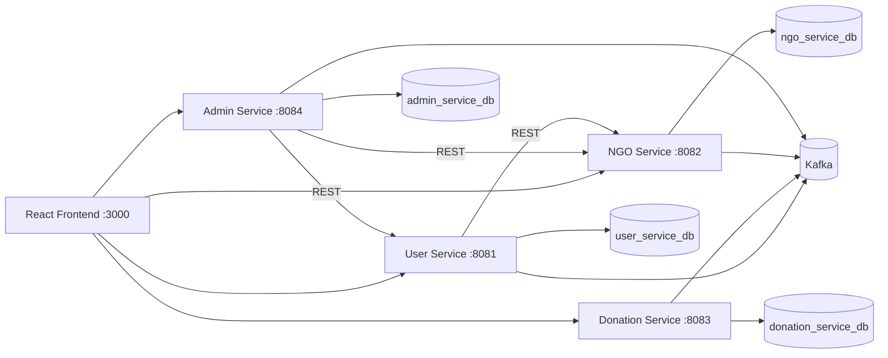

# SewaConnect — NGO Donation Platform

A microservices-based platform that connects **donors** and **NGOs**, making it easier to donate items or money and manage NGO donation packages securely.

**Repository:** [github.com/imsuraj22/SewaConnect](https://github.com/imsuraj22/SewaConnect)

---

## Demo video

Below is the demo video link for SewaConnect covering registration, NGO workspace, admin approval, and donation flow.

🎥 Demo Video:
https://drive.google.com/file/d/1hoBrr4w2ntdrk8Q6h1zC7IbMDadSrooU/view?usp=sharing


---

## Screenshots


> Add images under `docs/screenshots/` in your repo and update filenames if needed.

---

## Features

| Service | Responsibility |
|---------|----------------|
| **User Service** | Registration, JWT authentication, roles, profile management |
| **Donation Service** | Record donations (items/money), donation history, claim requests |
| **NGO Service** | NGO profiles, verification documents, donation packages/bundles, logos |
| **Admin Service** | Approve/reject NGOs and users, suspend/deactivate accounts, oversight |
| **React Frontend** | Donor, NGO, and admin dashboards with role-based routes |

**Cross-cutting capabilities**

- JWT authentication with shared `security-common` module
- Event-driven communication via **Apache Kafka**
- Inter-service REST calls (`RestTemplate`) with internal API key protection
- **PostgreSQL** persistence (separate database per service)
- Docker Compose for local infrastructure (Postgres, Kafka, Zookeeper)

---

## Tech Stack

| Layer | Technologies |
|-------|--------------|
| Backend | Java 17, Spring Boot 3.2, Spring Security, Spring Kafka, Spring Data JPA |
| Frontend | React 18, Vite, React Router |
| Messaging | Apache Kafka |
| Database | PostgreSQL 16 |
| Containerization | Docker & Docker Compose |

---

## Architecture



**Kafka topics (examples):** `ngo-save-request`, `ngo-status-events`, `claim-create-request`, `claim-request-approved`, `user-delete-request`, and related approval/rejection events.

---

## Project Structure

```
SewaConnect/
├── ngo-donation-platform-backend/
│   ├── security-common/       # Shared JWT utilities
│   ├── user-service/          # Port 8081
│   ├── ngo-service/           # Port 8082
│   ├── donation-service/      # Port 8083
│   ├── admin-service/         # Port 8084
│   ├── docker-compose.yml     # Postgres + Kafka + Zookeeper
│   └── docker/postgres/       # DB init scripts
└── ngo-donation-platform-frontend/
    └── src/                   # React pages & API clients
```

---

## Prerequisites

- **Java 17+**
- **Maven 3.8+**
- **Node.js 18+** and npm
- **Docker Desktop** (or Docker Engine + Compose)

---

## Setup & Run

### 1. Clone the repository

```bash
git clone https://github.com/imsuraj22/SewaConnect.git
cd SewaConnect
```

### 2. Start infrastructure

From the backend folder:

```bash
cd ngo-donation-platform-backend
docker compose up -d
```

This starts:

| Service | Port |
|---------|------|
| PostgreSQL | `5432` |
| Zookeeper | `2181` |
| Kafka | `9092` |

Postgres creates four databases on first boot: `user_service_db`, `donation_service_db`, `ngo_service_db`, `admin_service_db`.

Optional: create a `.env` file next to `docker-compose.yml` to override `POSTGRES_PASSWORD` or `POSTGRES_PUBLISH_PORT`.

### 3. Configure microservices

Each service needs its own `src/main/resources/application.properties` (these files are gitignored). Use the templates below.

**Shared values** — use the same JWT secret and internal API key in every service:

```properties
app.jwt.secret=change-me-to-a-secret-at-least-32-characters-long
app.jwt.expiration-ms=86400000
app.internal-api-key=change-me-internal-service-key
spring.kafka.bootstrap-servers=localhost:9092
```

**User service** (`user-service/src/main/resources/application.properties`):

```properties
server.port=8081
spring.datasource.url=jdbc:postgresql://localhost:5432/user_service_db
spring.datasource.username=postgres
spring.datasource.password=postgres
spring.jpa.hibernate.ddl-auto=update
ngo.service.url=http://localhost:8082

# Optional: create first admin on startup
app.bootstrap.admin.enabled=true
app.bootstrap.admin.username=admin
app.bootstrap.admin.email=admin@local.test
app.bootstrap.admin.password=Admin@123
```

**NGO service** (`ngo-service/src/main/resources/application.properties`):

```properties
server.port=8082
spring.datasource.url=jdbc:postgresql://localhost:5432/ngo_service_db
spring.datasource.username=postgres
spring.datasource.password=postgres
spring.jpa.hibernate.ddl-auto=update
```

**Donation service** (`donation-service/src/main/resources/application.properties`):

```properties
server.port=8083
spring.datasource.url=jdbc:postgresql://localhost:5432/donation_service_db
spring.datasource.username=postgres
spring.datasource.password=postgres
spring.jpa.hibernate.ddl-auto=update
```

**Admin service** (`admin-service/src/main/resources/application.properties`):

```properties
server.port=8084
spring.datasource.url=jdbc:postgresql://localhost:5432/admin_service_db
spring.datasource.username=postgres
spring.datasource.password=postgres
spring.jpa.hibernate.ddl-auto=update
user.service.url=http://localhost:8081
ngo.service.url=http://localhost:8082
```

### 4. Build and run backend services

Build the parent project once (installs `security-common`):

```bash
cd ngo-donation-platform-backend
mvn clean install -DskipTests
```

Start each service in a **separate terminal**:

```bash
cd user-service && mvn spring-boot:run
cd donation-service && mvn spring-boot:run
cd ngo-service && mvn spring-boot:run
cd admin-service && mvn spring-boot:run
```

**Health checks**

| Service | URL |
|---------|-----|
| User | `http://localhost:8081/user-health` |
| NGO | `http://localhost:8082/health` |
| Donation | `http://localhost:8083/health` |
| Admin | `http://localhost:8084/health` |

### 5. Run the frontend

```bash
cd ngo-donation-platform-frontend
npm install
npm run dev
```

Open **http://localhost:3000**

Optional environment overrides (`.env` in the frontend folder):

```env
VITE_USER_API=http://localhost:8081
VITE_NGO_API=http://localhost:8082
VITE_DONATION_API=http://localhost:8083
VITE_ADMIN_API=http://localhost:8084
```

---

## Frontend Routes

| Path | Access | Description |
|------|--------|-------------|
| `/` | Public | Home |
| `/login`, `/register` | Public | Authentication |
| `/ngos`, `/ngos/:id` | Donor | Browse NGOs |
| `/donate`, `/my-donations` | Donor | Create and view donations |
| `/profile` | Authenticated | User profile |
| `/ngo-dashboard`, `/ngo/bundles` | NGO | Workspace and packages |
| `/admin` | Admin | Platform administration |

---

## Sample API Endpoints

| Service | Endpoint | Method | Description |
|---------|----------|--------|-------------|
| User | `/auth/register` | POST | Register (donor or NGO) |
| User | `/auth/login` | POST | Login and receive JWT |
| User | `/auth/me` | GET | Current user (Bearer token) |
| Donation | `/donations` | POST | Create donation (multipart) |
| Donation | `/donations/donor/{donorId}` | GET | Donations by donor |
| NGO | `/api/ngos/register/{userId}` | POST | Register NGO profile |
| NGO | `/api/ngos/{ngoId}/packages` | POST | Create donation package |
| NGO | `/api/ngos/{ngoId}/submit-for-review` | POST | Submit NGO for admin review |
| Admin | `/admin/ngos/pending` | GET | Pending NGO approvals |
| Admin | `/admin/ngos/{ngoId}/approve` | POST | Approve NGO |
| Admin | `/admin/ngos/{ngoId}/reject` | POST | Reject NGO |

Protected endpoints require:

```
Authorization: Bearer <accessToken>
```

---

## User Roles

| Role | Capabilities |
|------|--------------|
| **Donor** (default) | Browse NGOs, donate, view donation history |
| **NGO** | Complete organization profile, upload documents, manage packages |
| **Admin** | Approve NGOs/users, suspend accounts, platform oversight |

---

## Stopping the stack

```bash
# Stop Spring Boot apps with Ctrl+C in each terminal

# Stop Docker infrastructure
cd ngo-donation-platform-backend
docker compose down
```

To remove Postgres data volumes as well:

```bash
docker compose down -v
```

---

## Future Enhancements

- Cloud deployment (Dockerized services + reverse proxy + HTTPS)
- CI/CD with GitHub Actions
- API gateway in front of microservices
- Analytics dashboard for NGOs and admins
- Email notifications for approvals and donations

---

## Contributors

**Suraj** — Backend & architecture
